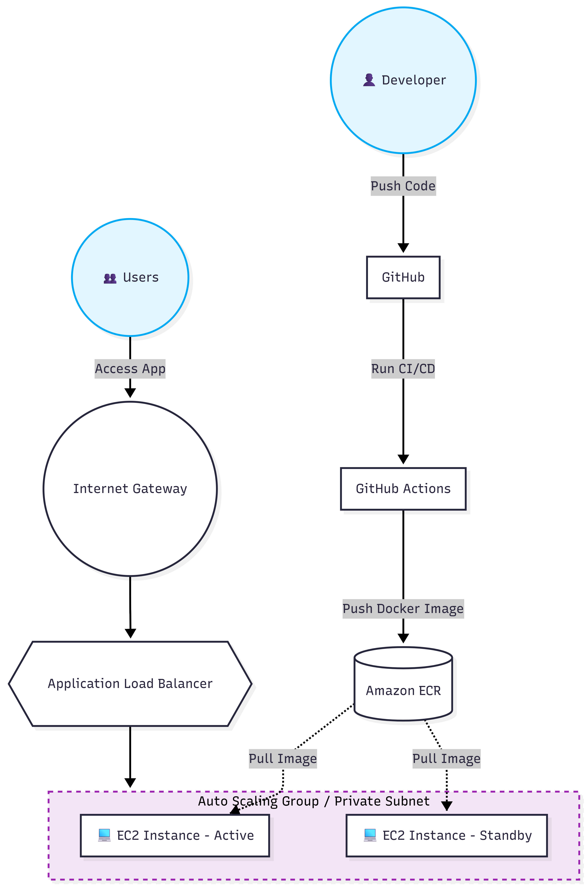

# Golden Owl CI/CD Pipeline Challenge

## 🚀 Overview
This repository contains the solution for the Golden Owl DevOps technical test. It demonstrates a robust, automated CI/CD pipeline using GitHub Actions, Docker, and AWS.

## 🏗 Architecture

*(The diagram illustrates a scalable architecture utilizing AWS Application Load Balancer and Auto Scaling Group, fulfilling the "Nice to have" requirement).*
## 🛠 Technologies Used
* **Application:** Node.js
* **Containerization:** Docker (Multi-stage build, Alpine-based, Non-root user)
* **CI/CD:** GitHub Actions
* **Cloud Provider:** AWS (ECR for Image Registry, EC2 for Compute)

## 🔄 CI/CD Workflow
1. **Continuous Integration (CI):** Triggered on PRs and pushes to `feature/*` branches. Runs dependencies installation and `npm test`.
2. **Continuous Deployment (CD):** Triggered on merges to `master`. Builds the Docker image, tags it with the commit SHA, pushes to Amazon ECR, and orchestrates deployment to the target environment.

## 🌐 Live Deployment
Application is successfully deployed and accessible at: **http://54.252.81.13**
